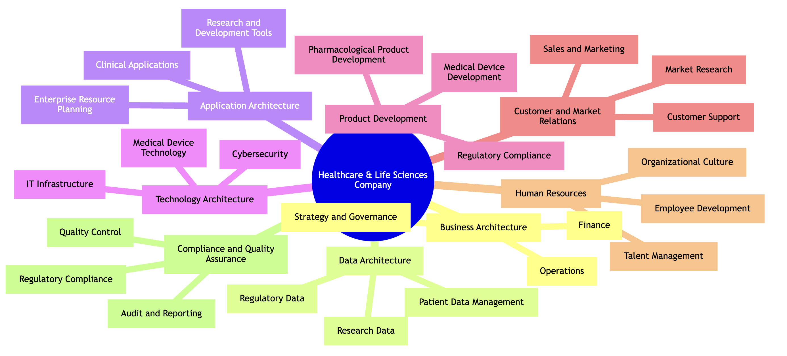

# Enterprise Architecture: Structuring into Domains and Subdomains

Creating an overview of an enterprise's architecture, including its domains and subdomains, is a fundamental step in understanding and managing the complex structure of an organization. This process involves several key steps:

## Define the Scope and Objectives
- Determine the goals of the enterprise architecture.
- Identify the areas of focus, such as alignment of IT with business goals or improving process efficiency.

## Gather Information
- Collect data from various sources within the organization.
- Engage with stakeholders to understand processes and technology usage.

## Identify Domains
- Break down the enterprise into core domains like Business Architecture, Data Architecture, Application Architecture, and Technology Architecture.

## Define Subdomains
- Identify subdomains within each domain.
- Document key components, processes, systems, and technologies in each subdomain.

## Create a Domain Map
- Develop a visual representation of these domains and subdomains.
- Use tools like Enterprise Architecture software for this purpose.

## Conduct Gap Analysis
- Compare the current state with the desired future state.
- Identify gaps in capabilities, processes, or technologies.

## Develop a Roadmap
- Create a plan for bridging identified gaps.
- Include initiatives, resource allocation, and timelines.

## Implement Governance
- Establish processes for maintaining and updating the enterprise architecture.
- Ensure compliance with standards.

## Review and Update Regularly
- Regularly revisit and revise the enterprise architecture.
- Reflect changes in business strategy, technology, and market trends.

Remember, the key to a successful enterprise architecture overview is collaboration across different departments and stakeholders, and tailoring the approach to the specific needs and context of your organization.

# Driving Questions for Identifying Domains and Subdomains

To effectively identify domains and subdomains in an enterprise, specific driving questions can guide the analysis. These questions are categorized by the main domains:

## Business Architecture
- What are the primary business goals and objectives?
- How is the business structured in terms of departments, units, and teams?
- What are the key business processes, and how do they align with the company's strategy?

## Data Architecture
- What types of data (patient, research, regulatory) does the company manage?
- How is data collected, stored, and utilized across different departments?
- What are the data governance and compliance requirements?

## Application Architecture
- What software applications are currently in use, and for what purposes?
- How do these applications support business processes and decision-making?
- Are there any gaps or redundancies in the application landscape?

## Technology Architecture
- What is the current state of the IT infrastructure (hardware, networks, cloud services)?
- How does the technology infrastructure support the operational needs of the business?
- What are the cybersecurity measures in place to protect sensitive data?

## Product Development
- What are the key products and services offered by the company?
- How is the product development process structured, from concept to market?
- What are the regulatory considerations in product development?

## Customer and Market Relations
- Who are the company's target customers and market segments?
- What are the marketing and sales strategies to reach these customers?
- How does the company gather and use customer feedback?

## Human Resources
- What is the company's approach to talent acquisition, development, and retention?
- How does the company support employee training and development?
- What is the organizational culture, and how does it align with business objectives?

## Compliance and Quality Assurance
- What are the regulatory requirements the company must adhere to?
- How does the company ensure product quality and safety?
- What are the processes for internal audits and compliance reporting?

These questions are designed to uncover detailed insights into each domain and subdomain, facilitating a comprehensive understanding of the enterprise's architecture.

# Sample Organization in Healthcare and Life Sciences

In a healthcare and life sciences company that creates medical devices (like CTs, MRTs, dialysis machines) and pharmacological products, the enterprise architecture encompasses several specialized domains and subdomains. Here's a sample overview:

## Business Architecture
- **Strategy and Governance**: Business goals, compliance, regulatory requirements, and risk management.
- **Operations**: Patient care processes, clinical services, supply chain management for medical devices and drugs.
- **Finance**: Budgeting, cost control, revenue management, and financial planning.

## Data Architecture
- **Patient Data Management**: Storage, protection, and management of patient records and clinical data.
- **Research Data**: Management of clinical trial data, research findings, and data from experimental studies.
- **Regulatory Data**: Documentation and data related to regulatory compliance and submissions.

## Application Architecture
- **Clinical Applications**: Software for diagnostics, patient monitoring, and treatment planning.
- **Enterprise Resource Planning (ERP)**: Systems for finance, HR, supply chain, and inventory management.
- **Research and Development Tools**: Applications supporting drug discovery, device prototyping, and clinical trials.

## Technology Architecture
- **Medical Device Technology**: Hardware and software components of medical devices, including imaging technology and dialysis machines.
- **IT Infrastructure**: Servers, cloud services, data centers, and network infrastructure.
- **Cybersecurity**: Security protocols, firewalls, and data encryption to protect sensitive health data.

## Product Development
- **Medical Device Development**: Design, engineering, and testing of medical devices.
- **Pharmacological Product Development**: Drug discovery, formulation, and clinical trials.
- **Regulatory Compliance**: Ensuring products meet health regulations and standards.

## Customer and Market Relations
- **Sales and Marketing**: Strategies for market penetration, customer outreach, and product promotion.
- **Customer Support**: After-sales service, maintenance of medical devices, and customer education.
- **Market Research**: Analysis of market trends, customer needs, and competitive landscape.

## Human Resources
- **Talent Management**: Recruitment, training, and retention strategies for skilled professionals.
- **Employee Development**: Training programs, especially for handling specialized medical equipment and software.
- **Organizational Culture**: Fostering a culture of innovation, compliance, and patient-centric care.

## Compliance and Quality Assurance
- **Regulatory Compliance**: Adherence to healthcare regulations and standards.
- **Quality Control**: Standards and processes to ensure product safety and efficacy.
- **Audit and Reporting**: Regular audits and reporting for internal and external stakeholders.

This overview is a general representation and can vary based on the specific operations, scale, and market focus of the company.
